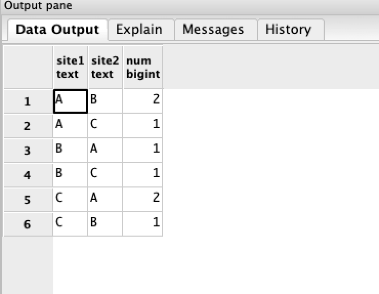

# Overview

The purpose of this project is introducing a SQL script that calculates the multi-hop values given the database tble represents the mobility of each user.  While the problem was solved for PostgreSQL, note that the requirement is to adjust based on Oracle 11, so this needs to be adjusted in near future.

# Contributors

Here show the contributors and their Githubs

Christopher Tate: https://github.com/computate

David Kaylor: https://github.com/d-kaylor

Bryant Son: https://github.com/bryantson

# Calculating Multi-Hop Mobility using SQL 
What is multi-hop? According to wikpedia (see [Multi-Hopping](https://en.wikipedia.org/wiki/Multi-hop_routing), Multi-hop routing (or multihop routing) is a type of communication in radio networks in which network coverage area is larger than radio range of single nodes. Therefore, to reach some destination a node can use other nodes as relays. 

In our context, to better the understand multi-hop, imagine 3 users (u1, u2, and u3) and 3 cellphone towers that they might ping off of (A, B, and C).

Over the course of a day, the first user may travel in such a way, that when using their phone, they ping the following towers:
AAAA BBB C A

Additional user trips might be:

u2: C A BB

u3: CC BBB A C

To calculate the mobility for each user user, we need to calculate all trips between areas, but not count "self-loops", or when the start and end towers are the same (i.e. A -> A).

First, we would simplify the trips to remove self-loops, finding their basic path in chronological order. 

For example, u1: A, B, C, A

Next, we need to calculate all permutations of trips among these locations:

Single-hop trips: 

A -> B, B -> C, C -> A

Two-hop trips: 

A -> C, B -> A

Three-hop trips:

 A -> A (this can be thrown out, as it is a self loop)

# Pre-Requisite
1. We used PostgreSQL installed for this excercise. But this has to be adjusted for  Oracle 11 and SQL 2008. 
2. Environment to run bash script

# Database Structure

We want to create a databse table where the columns are
sim_id : identifier of sim card, which is a primary key 
timestamp : datetime dd-mm-yyy hh:mm:ss, where hh is given in 24 hour format
event : the type of event that generated this row, can be sms, call, data, which is a varchar
site_id : antenna identifier, which is a varchar

However, the table structure above is just for testing purpose. The database could be hundreds of thousands to millions of lines, so the query should be efficient. It could be broken down into parts and use temporary tables, for example, so portions of the query can be run at a time to minimize chances of timing out. Variable names should be clear, so that this can be easily adapted to multiple different databases.

# Example 1
Let's start with a simple example. In the example above, where the data for one user is u1: A, B, C, A, we have A B C A as the sequence. This is unidirectional, and we generate the permutation, while removing self-loop and duplicates.

A -> B: 1

B -> C: 1

C -> A: 1

A -> C: 1

# Example 2

Let's look at slightly more complicated example. The activity sequences are:

u1: AAAA BBB C A

u2: C A BB

u3: CC BBB A C

And we can write as below:


Calculting the hops result in:

The mobility results should be:

AB: 2

AC: 2

BA: 2

BC: 2

CA: 3

CB: 2

# Steps
1. Connect to PostgreSQL 

2. Create a sample database table using the SQL queries above or create something like it. And insert the sample data.


```sql
-- CREATE Database Table to store the information --
CREATE TEABLE mobility(pk serial primary key, sim_id text, created timestamp, event text, site_id text);

-- INSERT the Sample Data Sets into the mobility table --
INSERT INTO mobility(sim_id, created, event, site_id) values('0001', timestamp '2018-10-11 00:00', 'sms', 'A');
INSERT INTO  mobility(sim_id, created, event, site_id) values('0001', timestamp '2018-10-11 00:00', 'sms', 'A');
INSERT INTO  mobility(sim_id, created, event, site_id) values('0001', timestamp '2018-10-11 01:00', 'sms', 'A');
INSERT INTO  mobility(sim_id, created, event, site_id) values('0001', timestamp '2018-10-11 02:00', 'sms', 'A');
INSERT INTO  mobility(sim_id, created, event, site_id) values('0001', timestamp '2018-10-11 03:00', 'sms', 'A');
INSERT INTO  mobility(sim_id, created, event, site_id) values('0001', timestamp '2018-10-11 04:00', 'sms', 'B');
INSERT INTO  mobility(sim_id, created, event, site_id) values('0001', timestamp '2018-10-11 05:00', 'sms', 'B');
INSERT INTO  mobility(sim_id, created, event, site_id) values('0001', timestamp '2018-10-11 06:00', 'sms', 'B');
INSERT INTO  mobility(sim_id, created, event, site_id) values('0001', timestamp '2018-10-11 07:00', 'sms', 'C');
insert into mobility(sim_id, created, event, site_id) values('0001', timestamp '2018-10-11 08:00', 'sms', 'A');
INSERT INTO  mobility(sim_id, created, event, site_id) values('0002', timestamp '2018-10-11 00:00', 'sms', 'C');
INSERT INTO  mobility(sim_id, created, event, site_id) values('0002', timestamp '2018-10-11 01:00', 'sms', 'A');
INSERT INTO  mobility(sim_id, created, event, site_id) values('0002', timestamp '2018-10-11 02:00', 'sms', 'B');
```
You can also download from sampleData.sql


3. Run the SQL script and see the output

```sql
SELECT site1, site2, count(*) num FROM (
	SELECT sim_id, site1, site2 FROM (
		SELECT m3.sim_id, m4.site_id site1, m5.site_id site2, m3.created1, m3.created2 FROM (
				SELECT m1.sim_id, m1.created created1, m2.created created2 FROM mobility m1 
				INNER JOIN mobility m2 on m1.sim_id = m2.sim_id AND m1.created < m2.created 
					GROUP BY m1.sim_id, m1.created, m2.created ORDER BY m1.sim_id, m1.created
			) m3 
			INNER JOIN mobility m4 ON m3.sim_id = m4.sim_id AND m3.created1 = m4.created 
			INNER JOIN mobility m5 ON m3.sim_id = m5.sim_id AND m3.created2 = m5.created 
			WHERE m4.site_id != m5.site_id
			ORDER BY m3.sim_id, m3.created1, m3.created2
		) m6 
		GROUP BY m6.sim_id, m6.site1, m6.site2, m6.site1, m6.site2 HAVING m6.site1 != m6.site2
	) m7 GROUP BY m7.site1, m7.site2
;

```




You can also see from calculateMobileHop.sql


That is all! 

